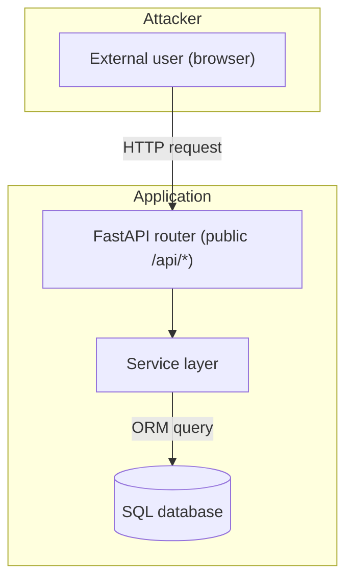

# Threat model

## Data flow diagram

```mermaid
flowchart TD
    subgraph TB1["Attacker"]
        A["External user (browser)"]
    end
    subgraph TB2["Application"]
        B["FastAPI router (public /api/*)"]
        C["Service layer"]
        D[("SQL database")]
    end
    A -->|"HTTP request"| B
    B --> C
    C -->|"ORM query"| D
```
