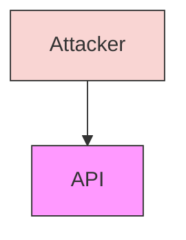

```mermaid
flowchart TD
    A["Attacker"] --> B["API"]
    style A fill:#f9d5d3,stroke:#333
    classDef trustBoundary fill:#f9f,stroke:#333;
    class A,B trustBoundary;
    click A "https://example.invalid"
```
